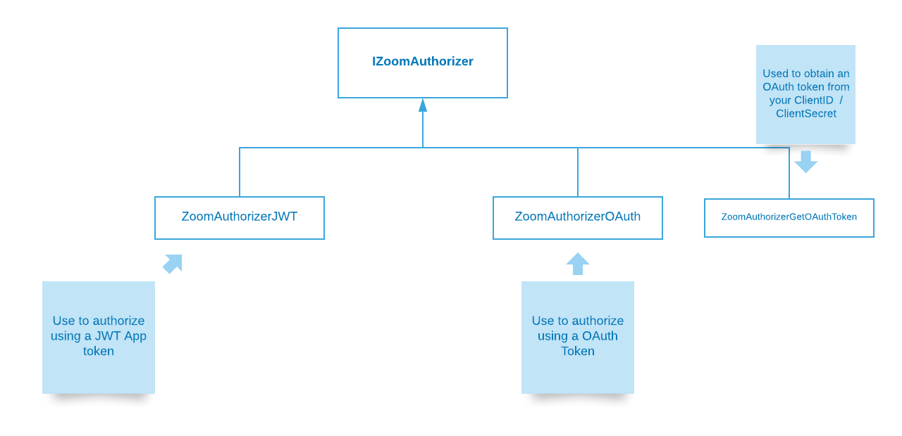
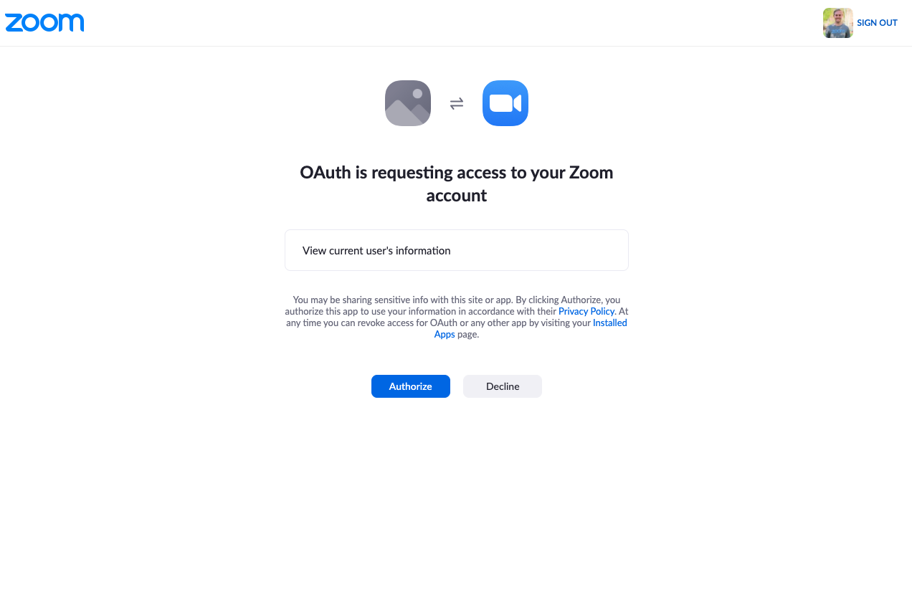

# Java Zoom API

This is a wrapper around the Zoom API that allows us to call it using native Java code.


## Features

1. Native Java calls instead of using HTTP

   ```java
   ZoomUser user = api.getUser("me");
   ```

2. Transparently use either **JWT** or **OAuth** authentication - the calls automatically use whichever is configured correctly

3. Automatically refreshes **OAuth** tokens correctly when needed

4. Wraps both `page_number` and `next_page_token` in a proper Java Iterator so paging records is transparently managed in the background (**WIP: Not Implemented Yet**)

## How to Use

The main class that wraps all API calls is [`ZoomAPI`](https://github.com/SalesboxAI/zoom-api-java/blob/master/src/main/java/com/salesboxai/zoom/ZoomAPI.java). Initialize this class and you’re ready to go making all Zoom calls.

```java
ZoomAPI za = new ZoomAPI(authenticator);
za.createMeeting(user, meetingrequest);
```

### Authentication

Depending on the type of App we are using (see [the Zoom Getting Started Guide](https://marketplace.zoom.us/docs/guides/getting-started)), we need to initialize the  [`ZoomAPI`](https://github.com/SalesboxAI/zoom-api-java/blob/master/src/main/java/com/salesboxai/zoom/ZoomAPI.java) with the appropriate Authenticator.




#### JWT Usage

In order to use a JWT App, first create your app on the Zoom marketplace and get it’s JWT token.

Initialize your `ZoomAPI` with a `ZoomAuthenticatorJWT` and you’re ready to go.

```java
ZoomAuthorizerJWT authorizer = new ZoomAuthorizerJWT(JWTToken);
ZoomAPI za = new ZoomAPI(authorizer);

// Get User
ZoomUser user = za.getUser("me");
System.out.println(user);

// Create a new meeting
ZoomMeetingRequest mreq = ZoomMeetingRequest.requestDefaults("Test Meeting", "Let's talk about the weather");
ZoomMeeting meeting = za.createMeeting("me", mreq);
System.out.println(meeting);

```

#### OAuth Usage

Create an OAuth application in the marketplace and set it’s callback to your application webhook. This allows users to click a link like this:

`https://zoom.us/oauth/authorize?response_type=code&client_id=7lstjK9NTyett_oeXtFiEQ&redirect_uri=https://yourapp.com`

and give your app permissions to make calls on their after reviewing what permissions you need:



When you get this request, use the `ZoomAPI::requestAccessToken` call to get a `ZoomAccessToken` that can be used for making calls on behalf of the user.

```java
// Use your app's secrets to convert the user
// 'code' into an access token you can use to
// make calls on their behalf
ZoomAuthorizerGetOAuthToken authorizer = new ZoomAuthorizerGetOAuthToken(clientID, clientSecret);
ZoomAPI za = new ZoomAPI(authorizer);

String code = req.params.get("code"); // get 'code' query parameter from callback
ZoomAccessToken oauthToken = za.requestAccessToken(code, redirectURL);

db.save(oauthToken); // save the token for use
```

Once you have a user token you can use it to make calls on the user’s behalf.

```java
ZoomAuthorizerOAuth authorizer = new ZoomAuthorizerOAuth(oauthToken);
ZoomAPI za = new ZoomAPI(authorizer);

// Get User
ZoomUser user = za.getUser("me");
System.out.println(user);

// Create a new meeting
ZoomMeetingRequest mreq = ZoomMeetingRequest.requestDefaults("Test Meeting", "Let's talk about the weather");
ZoomMeeting meeting = za.createMeeting("me", mreq);
System.out.println(meeting);

```

For more clarity, an example this flow is in [`OAuthTest.java`](https://github.com/SalesboxAI/zoom-api-java/blob/master/src/test/java/com/salesboxai/zoom/OAuthTest.java).

## TODO

* Pagination
* Other API calls

Contributions & Feedback welcome